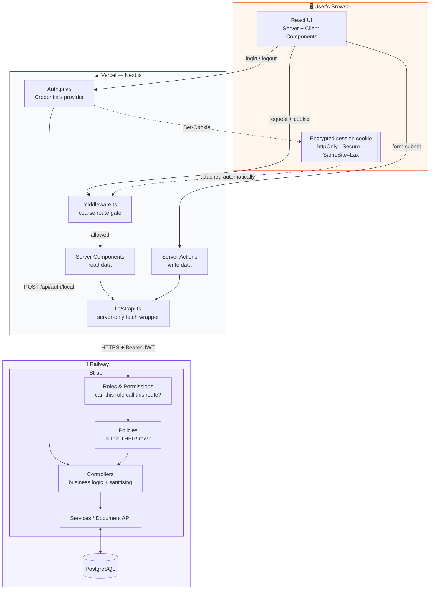
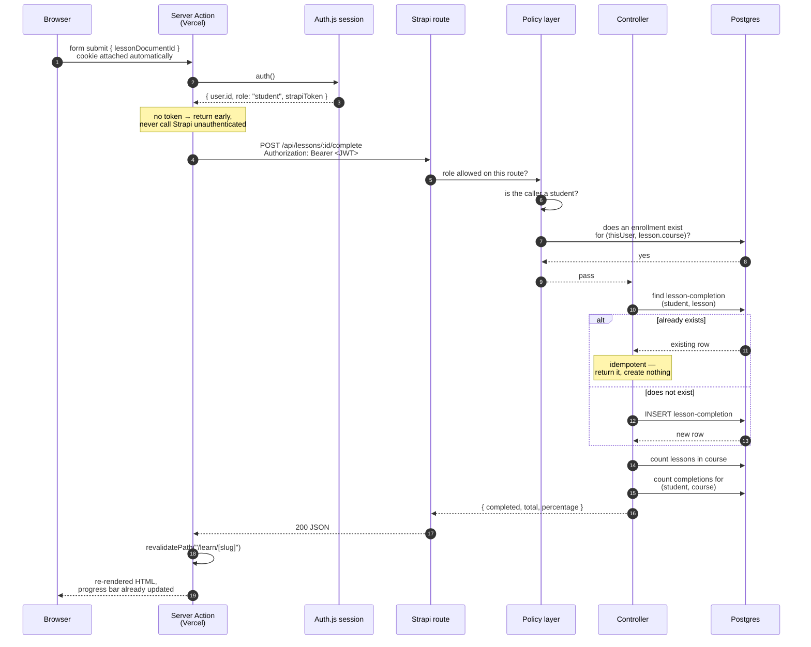
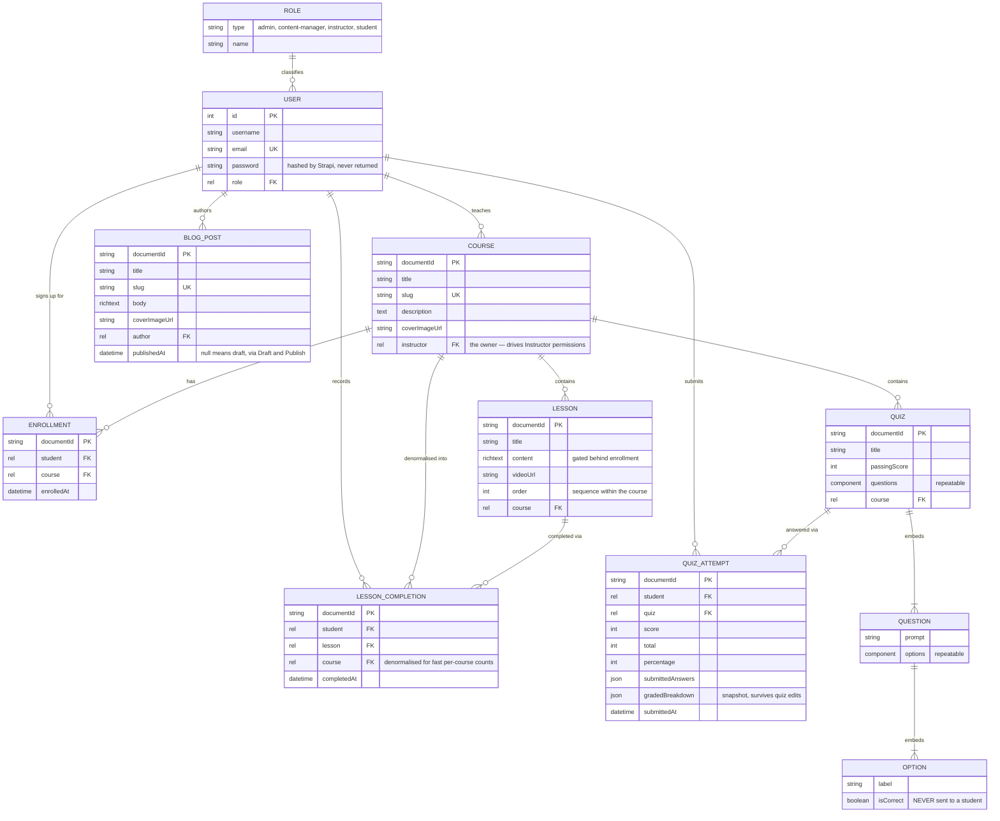
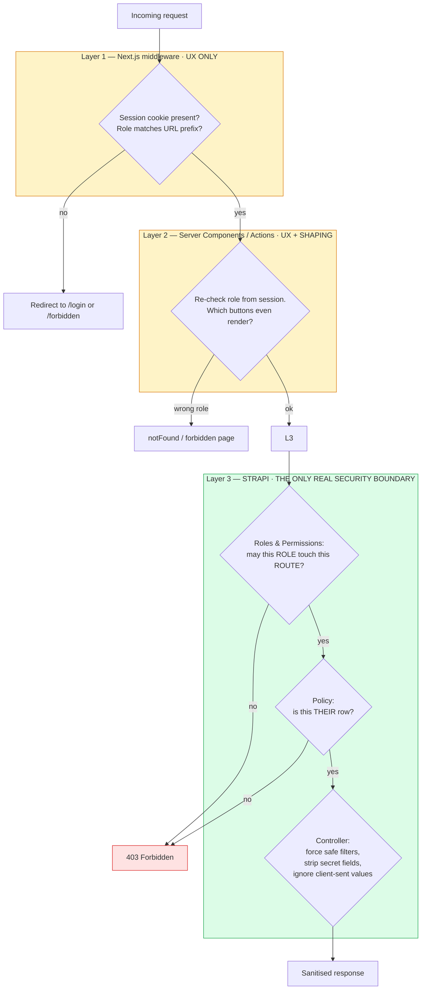

# LMS — System Design

> This document explains how the whole thing works. It is written for someone who is
> comfortable on the frontend but new to backend work. Read it before you write code,
> and read it again before you record the video — most of the questions the reviewers
> will ask are answered here.

---

## 1. The sixty-second version

There are **three separate programs** running in **two different places**:

| # | Program | Lives on | Job |
|---|---------|----------|-----|
| 1 | **PostgreSQL** | Railway | The database. Actual rows of data on a disk. |
| 2 | **Strapi** | Railway | The backend. Owns the database and owns the rules. Nothing enters or leaves the database without passing through here. |
| 3 | **Next.js** | Vercel | The frontend. Renders the HTML, holds the login session, and is the *only* thing that talks to Strapi. |

And one sentence that matters more than any other in this document:

> **The browser never talks to Strapi directly. Ever.**

Everything else in the design follows from that decision.

---

## 2. Why "the browser never talks to Strapi" is the whole design

The obvious way to build this — the way most tutorials show, and the way most other
candidates will do it — looks like this:

```
Browser  ──────────────────────────────────►  Strapi
         fetch("https://api.railway.app/...")
         Authorization: Bearer <token from localStorage>
```

That works. It is also weak, for four concrete reasons:

1. **The token is readable by any JavaScript on the page.** `localStorage` is not
   protected. One bad npm package, one injected script, one XSS hole in a
   comment field, and the attacker reads the token and becomes that user.
2. **Your backend URL becomes public.** Anyone opens DevTools and now knows exactly
   which Railway instance to hammer.
3. **You get CORS and cross-site cookie problems**, because `yourapp.vercel.app` and
   `yourapi.railway.app` are different sites. Cookies get blocked, you start setting
   `SameSite=None`, and it gets messy.
4. **You cannot render protected data on the server**, so every dashboard becomes a
   spinner-then-flash-of-content, and your page source is empty.

Our design instead:

```
Browser ────────────────► Next.js server ────────────────► Strapi ──────► Postgres
        encrypted cookie                  Bearer <JWT>
        (httpOnly, first-party)           (server-to-server, never seen by browser)
```

The token lives inside an **encrypted, httpOnly cookie** issued by Auth.js. `httpOnly`
means JavaScript literally cannot read it — only the browser's network layer can send
it back. And because the cookie travels between the browser and *your own Vercel
domain*, it is first-party: no CORS, no `SameSite` gymnastics.

Everything after login is a server-to-server call from Vercel to Railway, carrying the
Strapi JWT in an `Authorization` header that never touches the browser.

**Say this on camera.** It is the difference between "I followed a tutorial" and
"I made a decision."

---

## 3. Architecture



### What each Next.js piece is for

**`middleware.ts`** runs before every matching request, at the edge. It answers one
cheap question: *is there a session cookie at all, and does its role look right for
this URL prefix?* If not, redirect to `/login`. This is **user experience**, not
security — it stops a logged-out person seeing a broken dashboard. Never rely on it.

**Server Components** are React components that run on the Vercel server and stream
HTML to the browser. Because they run on the server they can read the session cookie
and call Strapi with the token. This is how a dashboard arrives already populated.

**Server Actions** are functions marked `"use server"` that a form can call directly.
The browser posts to Vercel, Vercel calls Strapi, then calls `revalidatePath()` so the
page re-renders with fresh data. No manual API routes, no client-side fetch.

**`lib/strapi.ts`** is the single choke point for every outbound call to Strapi. One
file. It pulls the token from the session, sets the header, handles errors, and is
marked `server-only` so importing it into a client component is a *build error*, not a
runtime leak. Having exactly one door in and out of the backend is what makes the
system reviewable.

---

## 4. One feature, end to end

Follow "student clicks **Mark as complete**" through every single hop. This is the
"data flow" section of your video — pick this one, it touches the most layers.



Six things to notice, because reviewers ask about exactly these:

1. **The browser sent an ID, not a percentage.** The client is never trusted to
   calculate anything that matters.
2. **The Server Action checks for a session before calling Strapi.** Fail fast.
3. **Enrollment is verified on the server.** A student cannot complete a lesson in a
   course they never enrolled in, even by crafting the request by hand.
4. **The write is idempotent.** Double-click, flaky network retry, two open tabs — you
   still get exactly one completion row. This is why progress can never exceed 100%.
5. **The percentage is computed server-side, from live counts.** Not stored, not
   cached, not sent by the client. Delete a lesson and every student's percentage is
   correct on the next read, automatically.
6. **`revalidatePath` is what makes the UI update.** No `useState`, no refetch hook.

---

## 5. Data model



### The four modelling decisions worth defending

**`LESSON_COMPLETION` is a table, not a boolean on the lesson.** A lesson is completed
*by a particular student*. If completion were a field on `Lesson`, the first student to
finish it would mark it done for everyone. One row per `(student, lesson)` pair is the
only correct shape. This is the single most common thing juniors get wrong here.

**`LESSON_COMPLETION` also stores `course`, even though you could reach the course
through the lesson.** That is deliberate denormalisation: it turns "how many lessons has
this student finished in this course" into one indexed count instead of a join plus a
filter. The tradeoff is that the field must be set from the lesson's course on the
server — never from the request body — or the two can disagree.

**Correct answers live in an embedded component with `isCorrect` on each option.** They
are stored with the quiz but **stripped in the controller before any response reaches a
student.** Grading happens on the server, in a request the student cannot see into. If
`isCorrect` ever appears in a student's network tab, the feature is broken no matter
what the UI does.

**`QUIZ_ATTEMPT` stores a `gradedBreakdown` snapshot, not just a score.** If the
instructor later edits the quiz — reorders options, fixes a typo, removes a question —
a stored answer index would become meaningless and the student's old result page would
show nonsense. The snapshot freezes what was asked, what they picked, and what was
correct, at submit time. This is the kind of edge case the brief means by
"differentiator."

---

## 6. Permissions: three layers, only one of which is security

The brief says it twice, so it is clearly the thing being tested:

> *Enforce this on the backend, not just by hiding buttons.*

Here is how that is actually done.



**Layers 1 and 2 are yellow because they are conveniences.** They stop a confused user
seeing a broken page. They stop nothing else — anyone can bypass them entirely with a
single `curl` command, because they run in code the attacker controls or can skip.

**Layer 3 is green because it is the only place an attacker cannot go around.** To
reach the database you must pass through Strapi. So that is where the rules live.

### Strapi's three sub-layers

**Roles & Permissions** is Strapi's built-in table of *role × route*. Can `student` call
`POST /api/courses`? No. Coarse, declarative, and it covers most of the permission
matrix on its own. Configured once in a bootstrap script so it is reproducible instead
of clicked by hand.

**Policies** are small functions that run *before* the controller and return true or
false. This is where "own only" lives — the rows in the matrix that Roles & Permissions
cannot express:

```js
// backend/src/api/course/policies/is-course-owner-or-manager.js
module.exports = async (policyContext, config, { strapi }) => {
  const user = policyContext.state.user;
  if (!user) return false;

  const role = user.role?.type;

  // Admin and Content Manager work across the whole platform.
  if (role === 'admin' || role === 'content-manager') return true;

  // An Instructor may only touch a course they own.
  if (role !== 'instructor') return false;

  const course = await strapi.documents('api::course.course').findOne({
    documentId: policyContext.params.id,
    populate: { instructor: { fields: ['id'] } },
  });

  if (!course) return false;
  return course.instructor?.id === user.id;
};
```

Fourteen meaningful lines. That is the entire "Own only" column of the matrix, and it
runs on the server where nobody can skip it. Have this file open in your video.

**Controller overrides** handle the three things policies cannot:

- **Forcing filters.** Strapi's default `find` lets the caller pass any `filters` they
  like. `GET /api/enrollments?populate=*` would happily return the whole platform's
  enrollments. So the student-facing list endpoints *overwrite* `ctx.query.filters`
  with `{ student: user.id }` — overwrite, not merge, because merging can be defeated
  by a crafted `$or`.
- **Stripping secrets.** Removing `isCorrect` from quiz options before the response
  leaves the server.
- **Ignoring client-sent values.** When an instructor creates a course, the
  `instructor` field is set from `ctx.state.user.id` and the body's value is discarded.
  Otherwise anyone could create a course owned by someone else.

### The matrix, mapped to real mechanisms

| Matrix row | Admin | Content Mgr | Instructor | Student | Enforced by |
|---|---|---|---|---|---|
| Manage users & assign roles | ✅ | ❌ | ❌ | ❌ | Custom `PUT /api/platform/users/:id/role` + `has-role: [admin]`. Default user update **disabled for everyone**. |
| Create / edit / delete course | ✅ | ✅ | Own | ❌ | R&P for create; `is-course-owner-or-manager` policy for update/delete; controller forces `instructor` on create |
| Add / edit / delete lessons | ✅ | ✅ | Own courses | ❌ | `can-manage-lesson` policy resolves lesson → course → owner |
| Create quizzes | ✅ | ✅ | Own courses | ❌ | `can-manage-quiz` policy, same resolution chain |
| View student progress | ✅ | ✅ | Own courses | Own only | Two endpoints: `/courses/:id/students` for staff, `/enrollments/me` for students. Different shapes, different guards. |
| Write / manage blog posts | ✅ | ✅ | ❌ | ❌ | R&P grants blog routes to admin + content-manager only |
| Enroll in a course | ❌ | ❌ | ❌ | ✅ | `has-role: [student]` on `POST /courses/:id/enroll` |
| Take quizzes | ❌ | ❌ | ❌ | ✅ | `has-role: [student]` + `is-enrolled` on `POST /quizzes/:id/submit` |

Note that the ❌ for staff on "enroll" and "take quizzes" is a real check, not an
oversight. An admin who enrolls in a course would pollute the enrollment stats and
create progress rows for a non-student. The brief says ❌, so it returns 403.

### Two things called "admin" — do not mix them up

Strapi has **its own admin panel** at `/admin` with its own separate user table
(super-admins who build content types). That is *not* the same as our application's
`admin` role, which lives in the `users-permissions` plugin alongside `student`.

Reviewers do ask about this. The one-liner: *"Strapi's `/admin` is the CMS operator
login for me as the developer. My application's admin role is a users-permissions role,
and the admin dashboard I built is a Next.js page at `/admin` on Vercel that talks to
guarded Strapi endpoints. Two different systems that happen to share a word."*

---

## 7. Where the four differentiators live

| Feature | Backend | Frontend | The bit that earns the marks |
|---|---|---|---|
| **Progress tracking** | `lesson-completion` table · idempotent `POST /lessons/:id/complete` · `GET /courses/:id/progress` computes from live counts | Progress bar in course player, percentage on My Courses cards | Per-student correctness, survives refresh because it is a DB row, cannot exceed 100% because writes are idempotent, self-corrects when lessons are added or deleted |
| **Quiz auto-grading** | `isCorrect` stripped on read · `POST /quizzes/:id/submit` grades server-side · attempt stored with frozen breakdown | Quiz form, instant result screen, past attempts list | Answers never reach the client; score is recomputed server-side and the client's own claim is ignored; unanswered questions handled explicitly |
| **Admin panel** | `GET /api/platform/stats` (counts) · `GET /api/platform/users` · `PUT /api/platform/users/:id/role`, all `admin`-only | `/admin` route group behind a role-checked layout | Role changes go through a purpose-built endpoint rather than the generic user update, which is what stops self-promotion |
| **Blog draft → publish** | Strapi Draft & Publish; `find`/`findOne` force `status=published` unless caller is admin or content-manager | Public blog list, editor with Save Draft / Publish | Drafts are invisible even to a hand-crafted `?status=draft` request — the guard is server-side |

---

## 8. Environment variables

The split here is itself a design decision worth pointing at.

### Backend — Railway

| Variable | Value / note |
|---|---|
| `HOST` | `0.0.0.0` — must bind all interfaces or Railway's proxy cannot reach it |
| `PORT` | Injected by Railway. Read it, never hardcode. |
| `APP_KEYS` | Four comma-separated random strings — session cookie signing |
| `API_TOKEN_SALT` · `ADMIN_JWT_SECRET` · `TRANSFER_TOKEN_SALT` · `ENCRYPTION_KEY` | Random secrets. Strapi refuses to boot without them. |
| `JWT_SECRET` | Signs the **user** JWTs that Next.js sends back as Bearer tokens |
| `DATABASE_CLIENT` | `postgres` |
| `DATABASE_URL` | Railway variable reference to the Postgres service — do not paste the literal string |
| `DATABASE_SSL` | `true`, with `rejectUnauthorized: false` in the SSL options |
| `NODE_ENV` | `production` |
| `FRONTEND_URL` | Your Vercel URL, for the CORS allowlist |
| `SEED_DEMO_DATA` · `DEMO_USER_PASSWORD` | Controls the first-boot seed |

### Frontend — Vercel

| Variable | Value / note |
|---|---|
| `STRAPI_URL` | Railway backend URL. **No `NEXT_PUBLIC_` prefix.** |
| `AUTH_SECRET` | Encrypts the Auth.js session cookie |
| `AUTH_TRUST_HOST` | `true` |

**Why local SQLite and production Postgres.** Railway's filesystem is ephemeral —
containers get replaced and anything written to disk vanishes. A SQLite file would
silently take all your data with it on the next deploy. Locally, SQLite means zero
setup. Strapi abstracts the difference, so one `config/database.js` switching on
`DATABASE_CLIENT` covers both.

**Why there is no `NEXT_PUBLIC_STRAPI_URL`.** Anything prefixed `NEXT_PUBLIC_` is
inlined into the JavaScript bundle and shipped to every visitor. Since only the Vercel
server ever calls Strapi, the backend URL stays a server-side secret. If you ever find
yourself *needing* that prefix, you have accidentally moved a Strapi call into the
browser — treat it as a design alarm, not a config problem.

**No file uploads anywhere.** The brief allows cover *image URLs*, so we take that
option. Uploaded files on Railway would disappear on redeploy, which would mean adding
Cloudinary or S3 — a whole extra integration for zero marks. Recognising that is a
better engineering signal than building it.

---

## 9. The leak tests

These are the checks that prove Layer 3 works. Run every one before recording, with a
real student token, and keep the terminal output — showing two or three of these
passing is the strongest ninety seconds of the video.

| # | Attack | Expected |
|---|---|---|
| 1 | Student `POST /api/courses` | `403` |
| 2 | Instructor `PUT /api/courses/:id` on a course they do not own | `403` |
| 3 | Student `GET /api/enrollments?populate=*` | Only their own rows |
| 4 | Student `PUT /api/users/:id` with `{ role: <admin role id> }` | `403`, role unchanged |
| 5 | Student `GET /api/quizzes/:id` | Options present, **no `isCorrect` anywhere** |
| 6 | Student `POST /api/quizzes/:id/submit` with `{ score: 100 }` in the body | Real score returned; the sent value ignored |
| 7 | Anonymous `GET /api/blog-posts?status=draft` | Published posts only |
| 8 | Student `POST /api/lessons/:id/complete` for a course they are not enrolled in | `403` |
| 9 | Student `GET /api/lessons/:id` for a course they are not enrolled in | `403` — lesson content is gated |
| 10 | Instructor `GET /api/platform/stats` | `403` |
| 11 | Same `POST /api/lessons/:id/complete` fired twice | One row, percentage unchanged |
| 12 | Logged-out browser visits `/admin` | Redirect to `/login` |

Number 6 is the one to demonstrate live. Sending a fake score and watching the server
return the real one makes the "never trust the client" point better than any
explanation.

---

## 10. Deliberate decisions, and what they cost

Reviewers respect an acknowledged tradeoff far more than a hidden one. Each of these
belongs in the README, and two or three of them belong in the video.

| Decision | Why | What it costs |
|---|---|---|
| Browser never calls Strapi | XSS-safe token, no CORS, server-rendered protected pages | Every mutation needs a Server Action; slightly more code than `fetch` from a component |
| Auth.js over hand-rolled cookies | Battle-tested session encryption, CSRF handling, clean `signIn`/`signOut` | One more library to understand; Credentials provider needs the `auth.config.ts` split to stay edge-safe |
| Everyone registers as **student**; only admin promotes | Removes privilege escalation at signup entirely — the request has no role field to tamper with | Demoing an instructor requires the admin to promote first, so the seed script must create one |
| Percentage computed, never stored | Cannot drift; self-heals when lessons change | Two counts per read instead of one field lookup. Irrelevant at this scale. |
| `course` denormalised onto `lesson-completion` | Per-course counts stay a single indexed query | Must be set server-side from the lesson, or the two can disagree |
| Cover images as URLs, no upload pipeline | Railway's disk is ephemeral; the brief permits URLs | No drag-and-drop upload UX |
| Strapi's native Draft & Publish for the blog | Uses the CMS feature that exists rather than reinventing it | `?status=draft` is caller-controllable by default, so it needs an explicit server-side guard |
| Postgres in prod, SQLite locally | Ephemeral filesystem would eat a SQLite file on redeploy | Two database configs to keep in step |

---

## 11. Build order, and why

Backend first, in this order — each step only depends on the ones above it.

```mermaid
flowchart LR
    P1["1 · Repo + git"] --> P2["2 · Strapi boots<br/>+ Postgres config"]
    P2 --> P3["3 · Content types<br/>+ relations"]
    P3 --> P4["4 · Roles + seed script<br/>4 roles, demo users"]
    P4 --> P5["5 · Policies +<br/>controller hardening"]
    P5 --> P6["6 · Custom endpoints<br/>enroll · complete · grade · stats"]
    P6 --> P7["7 · Next.js + Auth.js<br/>login works"]
    P7 --> P8["8 · Public pages"]
    P8 --> P9["9 · Student flow"]
    P9 --> P10["10 · Teach flow"]
    P10 --> P11["11 · Admin panel"]
    P11 --> P12["12 · Polish + a11y"]
    P12 --> P13["13 · Deploy<br/>Railway + Vercel"]
    P13 --> P14["14 · README +<br/>leak tests + video"]

    style P5 fill:#dcfce7,stroke:#16a34a
    style P6 fill:#dcfce7,stroke:#16a34a
    style P13 fill:#fef3c7,stroke:#d97706
```



Two warnings from experience.

**Do not leave deployment until the last day.** Railway and Vercel both fail in
boring, specific ways the first time — a missing `ENCRYPTION_KEY`, a wrong root
directory, an SSL flag. Deploy an empty Strapi at the end of step 2, before you have
written any features. Then every later deploy is a small delta instead of a
first-time-everything debugging session at 11pm on the 30th.

**Steps 5 and 6 are green because they are where the marks are.** The brief says the
access control "is itself part of what we're evaluating." If you run short on time,
cut polish, cut a page, cut styling — do not cut the policies.

---

## 12. Glossary

**JWT** — a signed string containing a user id. Strapi issues one at login and can
verify it later without a database lookup. Signed, not encrypted: readable by anyone,
forgeable by nobody without `JWT_SECRET`.

**Bearer token** — the `Authorization: Bearer <jwt>` header. Literally "whoever bears
this token is that user," which is exactly why it must never sit in `localStorage`.

**httpOnly cookie** — a cookie JavaScript cannot read. Immune to token theft by
injected scripts.

**Policy** — in Strapi, a function running before a controller that returns true or
false. Answers "may you?"

**Controller** — the function handling a route. Answers "here is what happens."

**Service** — reusable logic a controller calls. Where shared business rules live.

**Document Service API** — Strapi 5's data access layer,
`strapi.documents('api::course.course').findOne(...)`. Replaces v4's Entity Service.

**`documentId`** — Strapi 5's public identifier, a string. Distinct from the numeric
`id`. Use `documentId` in REST URLs. (Users are the exception: the
users-permissions plugin still keys on numeric `id`.)

**Idempotent** — running it twice has the same effect as running it once. Why
double-clicking "complete" cannot push you to 120%.

**Denormalisation** — deliberately storing a duplicate of a value you could derive, to
make reads faster. A speed-for-consistency trade.

**Server Component** — a React component that runs only on the server. Can hold
secrets. Ships zero JavaScript to the browser.

**Server Action** — a server function a form can call directly, no API route needed.

**`revalidatePath`** — tells Next.js a cached route is stale so the next render refetches.

**Ephemeral filesystem** — a disk that is wiped when the container restarts. Why
Railway needs Postgres and cannot keep SQLite or uploaded files.
